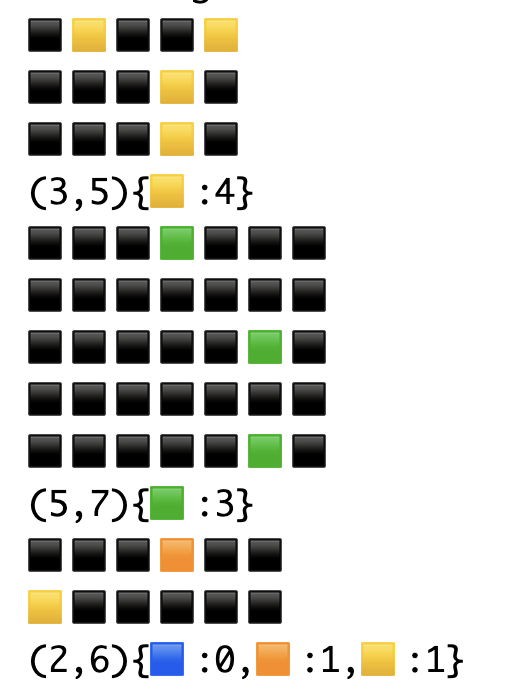
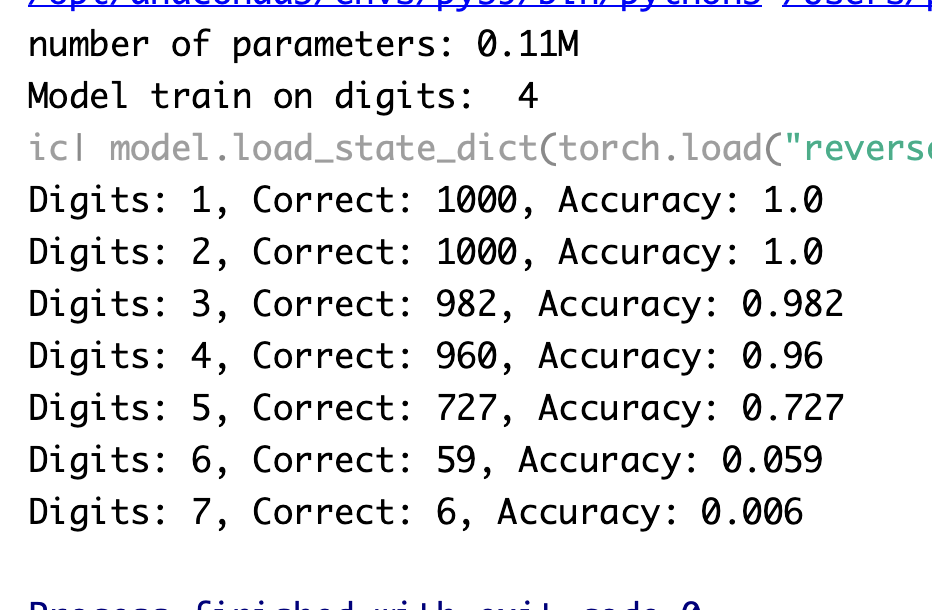

# GPT Experiments

This repository contains several transformer training experiments including dataset generators for simple arithmetic,
string reversal, and basic descriptions of grids of colored squares.

All of these examples share a common GPT model and trainer class with flexible configuration, inspired 
by Andrej Karpathy's [minGPT](https://github.com/karpathy/minGPT) but utilizing as much standard Pytorch as possible. 
The datasets generate sample-target pairs and shift them across a fixed-length context window calculated
to hold the largest samples.

This is a work in progress and any [feedback](https://pat.net) is welcome. 

### gpt_grid

gpt_grid generates a configurable dataset of random grids of varying dimensions and
number of colored squares, followed by a compact string 
description of the grid that can be learned.  The dataset includes code to validate the
test set output and report acurracy on the test set.

<table>
<tr>
<td></td>
<td></td>
</tr>
</table>
<p align="center"></p>

Even a very small (e.g. two layer) transformer can learn this fairly quickly but some work
needs to be done on data coverage to more reliably get it accuracy higher than about 80%.

### gpt_addition

gpt_addition generates a dataset of simple arithmetic addition problems of varying length
addends with a sum.  The dataset includes validation code that parses the output and
checks the accuracy of the model using the test set.

<p align="center"></p>

It is fairly easy for a small transformer to learn arbitrary addition problems 
of lengths that it has seen in its training set, however in this form they do not learn
to generalize to longer problems.  

A [recent paper](https://arxiv.org/html/2406.00075v2) shows a direction that teaches a more generalizable method.


### gpt_reverse_strings

gpt_reverse_strings generates a simple dataset for learning string reversal.

<table>
<tr>
<td></td>
<td></td>
</tr>
</table>

### gpt_tiny_stories

This is an implementation of training for 
[TinyStories](https://arxiv.org/abs/2305.07759) (Ronen Eldan, Yuanzhi Li, 2023)
which is a fascinating dataset of minimalist stories written with the vocabulary 
of a 3-4 year old child.  It can be used to demonstrate that even a very small (e.g. 2 layer)
transformer can learn to generate coherent grammar and with some story consistency.

### shared

This contains the shared `gpt_model` and `train` classes that are used by all the experiments.
These are a basic but realistic GPT model and trainer using Pytorch.

The model offers two implementations of positional embeddings: the standard sinusoidal 
and a learned embedding using nn.Embedding.

### Running

See the `learn_xxx` script in each experiment directory and adjust the model, dataset,
and training config parameters as desired.
Adjust the training loop callback in that file to control the frequency of testing and reporting.
See the `default_config()` method in each dataset for a full list of parameters that can be adjusted.

Weights & Biases logging of the loss and validation scores is supported but can be turned
off in the config or ignored.

Some model sizes run best using the `mps` device on Apple Silicon and some do better on the CPU.

```python
config = Config(
    model=GPT.default_config().add(
        n_layer=2,
        # embd_pdrop=0.15,
        # block_pdrop=0.15,
    ),
    data=GPTAdditionDataset.default_config().add(
        digits=2,
        num_samples=int(1e5),
    ),
    trainer=Trainer.default_config().add(
        device="mps",  # "cuda" or "cpu"
        batch_size=32,
        learning_rate=3e-3,
        # weight_decay=0.3,
    ),
)
```

...
